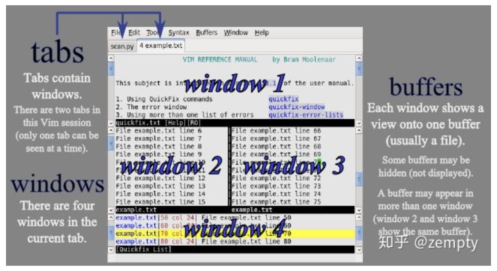

# Editors (Vim)

## Philosophy

* Vim interface itself is a programming language
* Vim avoids the use of the mouse

## Modal Editing

### Different Modes of Vim

Keystrokes have different meanings in different modes

* **Normal**: Moving around a file and making edits `<ESC>`
* **Insert**: For inserting text `i`
* **Replace**: for replacing text `R`
* **Visual**: for selecting blocks of tex
* **Command-line**: for running a command `:`

## Basics
### Buffers, tabs, windows

* **Buffers**: a set of open files
* **Tabs**: a vim session has a number of tabs
* **Windows**: Each tab has a number of windows, each window shows a single buffer. Windows are merely **views**. `:sp`

### Command-line

* `:qa` Close all of the open windows

* `:e {name of open file}` Open file for editing

* `:ls` Show open buffers

* `:help {topic}` open help instructions

* `:s/old/new` substitute "old" by "new" in this line `:#,#s/old/new/g` #,# are the line numbers

  `%s/old/new/g` substitute in the whole file `%s/old/new/gc` with a prompt about whether to substitute

* `:r FILE` insert the content of FILE in the current line `:r !ls` insert the output of `ls`

 ## Vim's interface is a programming language

### Movements (Nouns)

- Basic movements: `hjkl` (left, down, up, right)
- Words: `w` (next word) `b` (beginning of word) `e` (end of word)
- Lines: `0` (beginning of the file) `^` (first non-blank character) `$` (end of line)
- Screen: `H` (top of the screen) `M` (middle of the screen) `L` (bottom of the screen)
- Scroll: `Ctrl+u` (up) `Ctrl+d` (down)
- File: `gg` (beginning of file) `G` (end of file) `{line number}G` go to a specific line
- Line numbers: `:{number}`
- Find: `f{char}` `t{char}` `F{char}` `T{char}` to find a character on the current line. `,` or `;` to navigating matches back and forth
- Search: `/{regex}`,  `n` or `N` to navigate matches back and forth 
- `%`: swtich between '[' and ']' or '(' and ')' back and forth.
- `/str` find `str` in the file, `n` can move to the next match

### Selection

- Visual :`v`
- Visual line: `V`
- Visual Block: `Ctrl-v`

### Edits (Verbs)

- `o` / `O`: insert line below / above
- `d{movement}`: `dw` (delete the word) `d0` (delete to the beginning of the line) `dgg` (delete to the beginning of the file) `d$`(delete to end of the line)
- `c{movement}`: change, delete and enter the insert mode `cw` (change a word) `cc`(delete the entire line and enter the insert mode at the cursor)
- `dd` delete the line `cc` delete the line and insert something
- `x` delete a character `r{char}` delete the character and replace with {char} `s` delete and enter the insert mode
- In visual mode, select something and `d` will delete it, `c` will change it
- `u` undo `Ctrl-r` redo
- `y{movement}` copy something specified by {movement} `y` copies the line `y1w` copies one word
- `p` to paste
- `~` flip the case of a character
- `.` repeat the previous edit operation

### Counts: Combine nouns and verbs with counts

- `3w` move 3 words forward
- `5j` moves 5 lines down
- `7dw` delete 7 words

### Modifiers

`i` means "inside", `a` means "around"

- `ci(` change the contents inside the current pair of parentheses
- `da'` delete a single-quoted string, including the single quote

