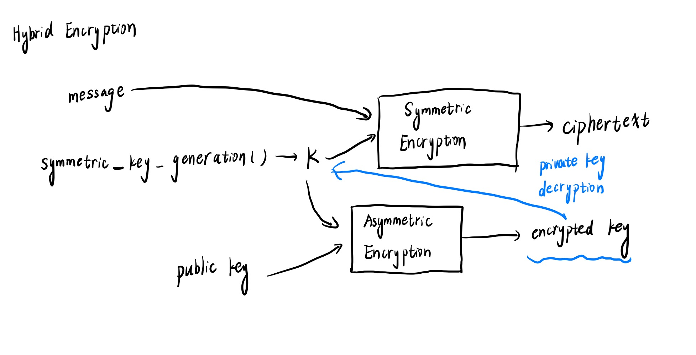

# Security and Cryptography

## Entropy

- A measure of randomness, measured in bits:
  $$
  entropy = log_2N \\
  $$
  , where $N$ is the number of possibilities, assuming equally possible

- The attacker should be assumed to know the possible model of the password. e.g. having some vague format of a common password from the password database

- A rough guideline

  - For online guessing, ~40 bits of entropy is pretty good
  - For offline guessing, 80 bits or more of entropy would be necessary

## Hash Functions

- A cryptographic hash function maps data of arbitrary size to a fixed size. A rough specification:

  ```pseudocode
  hash(value: array<byte>) -> vector(byte, N)
  ```

- Properties

  - **Deterministic**: the same input always generate the same output
  - **Non-invertible**: it is hard to find an input `m` such that `hash(m)=h` for some desired output `h`
  - **Target collision resistant**: given some input `m1`, it's hard to find a different input `m2` such that `hash(m1) == hash(m2)`
  - **Collision resistant**: it's hard to find two inputs `m1` and `m2` such that `hash(m1) == hash (m2)`, which is a strictly stronger property than target collision resistant

- Applications:

  - Git: for content-addressed storage
  - A short summary of the contents of a file. You can use the hash to check whether the downloaded file could be trusted. The official sites usually post hashed alongside the download links.
  - Commitment shemes. e.g. Flip a coin in someone's head and show its hash value. Then after someone else guesses the coin is head or tail, he can reveal the value in his mind and this can be validated by the hash value.

- Cryptographic hash function is a subset of hash functions. Hash function may also be used for data structures like  `HashMap`

## Key Derivation Functions (KDFs)

- Producing fixed-length output for use as keys in some cryptographic algorithms.
- KDFs are usually designed to be slow deliberately to slow down offline brute-force attack.
- Applications
  - Producing keys from passphrases for use in some cryptographic algorithms, e.g. symmetric cryptography
  - Storing login credentials: storing plaintext passwords is a bad manner. The right approach should be generate and store a random salt: `salt = random()` for each user. Store `KDF(passward + salt)` and verify login attempts by recomputing KDF given the entered passward and the stored salt.

## Symmetric Cryptography

- An abstract API for symmetric cryptograph:

  ```pseudocode
  keygen() -> key (a randomized function)
  
  encrypt(plaintext: array<byte>, key) -> array<byte> (the ciphertext)
  decrypt(ciphertext: array<byte>, key) -> array(byte) (the plaintext)
  ```

- Properties:

  - The `encrypt` function should have the property that given the ciphertext, it's hard to determine the input without the key.
  - An obvious correctness property: `decrypt(encrypt(m, k), k) = m`

- Applications

  - Encrypting files for storage in an untrusted cloud service
  - Encrypting a file with a passphrase combined with KDFs. Generate the key `key=KDF(passphrase)` and then store `encrypt(file, key)`

## Asymmetric Cryptography

- "Asymmetric" refers to there being two keys with two different roles. The public key can be publicly shared and it won't affect security.
- An abstract API for asymmetric cryptography:

```pseudocode
keygen() -> (public key, private key) (a randomized function)

encrypt(plaintext: array<byte>, public key) -> array<byte> (the ciphertext)
decrypt(plaintext: array<byte>, private key) -> array<byte> (the plaintext)

sign(message: array<byte>, private key) -> array<byte> (the signature)
verify(message: array<byte>, signature: array<byte>, publickey) -> bool (whether or not the signature is valid)
```

- Properties
  - Given the ciphertext, it's hard to determine the plaintext without the private key
  - Correctness property: `decrypt(encrypt(m, publickey), privatekey) = m`
  - Whatever the message is, without the private key, it's hard to produce a signature such that `verify(message, signature, publickey)=true`
- Applications
  - PGP email encryption: People can have their public keys online, and someone else can send an encrypted email
  - Private messaging: Apps like [Signal](https://signal.org/) and [Keybase](https://keybase.io/) use asymmetric keys to establish private communication channels
  - Signing software: Git can have GPG-signed commits and tags. With a posted public key, others can verify the authenticity of the downloaded software
- Key Distribution: a big challenge of distributing public keys / mapping public keys to real-world identities. There are many solutions to this:
  - *Signal*: in-person verification
  - *PGP*: [web of trust](https://en.wikipedia.org/wiki/Web_of_trust)
  - *Keybase*: [social proof](https://keybase.io/blog/chat-apps-softer-than-tofu)

## Case Studies

### Passward Manager

- Make it convenient to use unique, randomly generated high-entropy passwards for all your logins.
- Save all of your passwards in one place, encrypted with a symmetric cipher with a key produced from a passphrase using a KDF.
- Benefits
  - Avoid passward reuse
  - Use high-entropy passwards
  - Only need to remember a single high-quality passward
- Managers
  - [KeePassXC](https://keepassxc.org/)
  - [pass](https://www.passwordstore.org/)
  - [1Passward](https://1password.com/)

### Two-factor Authentification (2FA)

- Two-factor authentification requires you to use a passphrase("something you know") along with a 2FA authenticator("something you have") to protect the stolen passward and phishing attacks

### Full-disk Encryption

- Keep the entire disk of your laptop encrypted with a symmetric cipher.

### Private Messaging

- [Signal](https://signal.org/) and [Keybase](https://keybase.io/). You should obtain the contacts' public keys. Maybe considering authenticating public keys out-of-band.

### SSH

- `ssh-keygen` will generate an asymmetric key-pair `publickey` and `privatekey`. It asks for a passphrase and is fed through a KDF to produce a key. The key is used to encrypt the private key with a symmetric cipher.
  - `publickey` is stored as-is
  - `privatekey` should be encrypted on disk
- Once the server konws the client's public key (stored in `.ssh/authorized_keys` file), the connecting client can prove its identity using asymmetric signatures. 
  - The server picks a random number and sends to the client
  - The client signs the message and sends the signature back to the server
  - The server checks the signature using the public key on record.

## Example of Combining Symmetric and Asymmetric Cryptography

