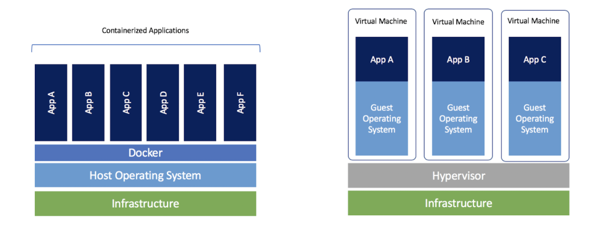

# Virtual Machines and Containers

This is an extra note from the [2019 version](https://missing.csail.mit.edu/2019/virtual-machines/).

## Virtual Machines

- To experiment with operating systems, software and configurations without risk.
  - running a software that only runs on a certain operating system
  - experimenting potentially malicious software

### Useful Featrues

- **Isolation**: hypervisors isolate the guest from the host
- **Snapshots**: you can take snapshots of the virtual memory, capturing the entire machine state and then restore to an earlier state. 
  - Useful to test out potentially destructive operations

### Disadvantages

- Slower than running on bare metal

### Resources

- Hypervisors
  - VirtualBox
  - Virt-manager
  - VMWare

## Containers

- VMs are heavy-weight, containers allow you to spin up machines in an automated fashion. Containers have higher performance but less secure and isolated than VMs.
  - Amazon Firecracker
  - Docker
  - rxt
  - lxc
- Containers: an assembly of various Linux security features to give the appearance of virtualization
  - virtual file system
  - virtual network interfaces
  - chroot
  - virtual memory tricks
- The difference betweem VMs and containers:

- Containers are handy when you want to run an automated task in a standardized setup. Sometimes a machine needs to run many services with conflicting dependencies, then they can be isolated by containers.
  - Build systems
  - Development environments
  - Pre-packaged servers
  - Running untrusted programs
    - Grading student submissions
    - Cloud computing
  - Continuous Integration (CI)
    - Travis CI
    - Github Actions
- Workflows
  - A minimal base image (Alpine Linux)
  - A list of commands to run to set up the environment you want (install package, copy files and build stuff)
  - Specify external ports that should be availble, an entrypoint that dictates what command should be run when the container is started.
- [DockerHub](https://hub.docker.com/) has many software services have prebuilt images that one can easily deploy

